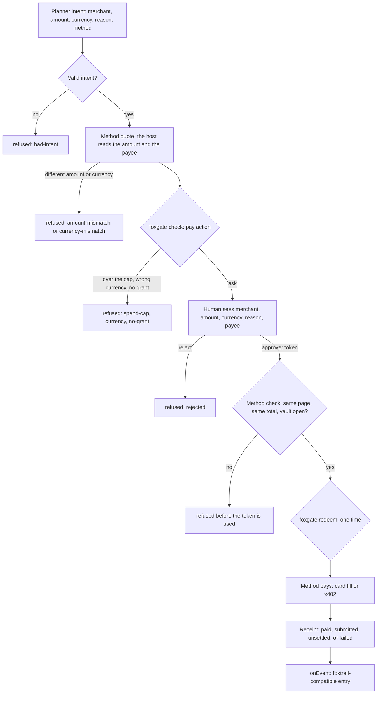
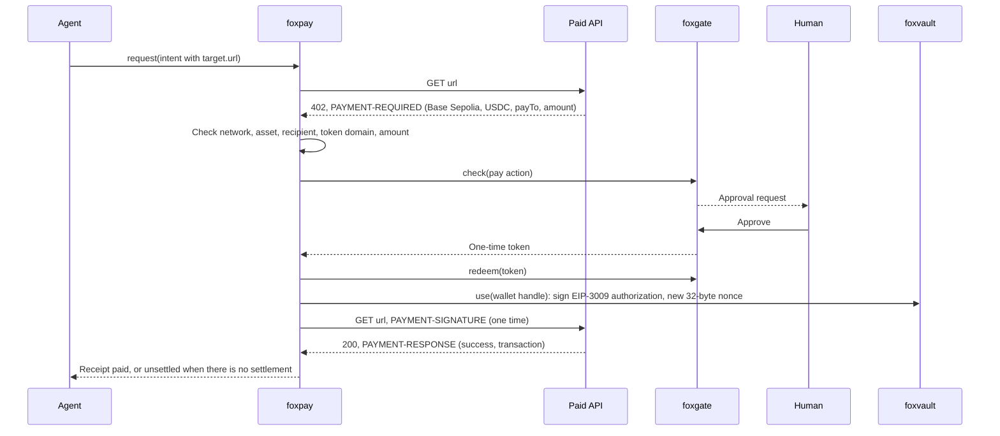
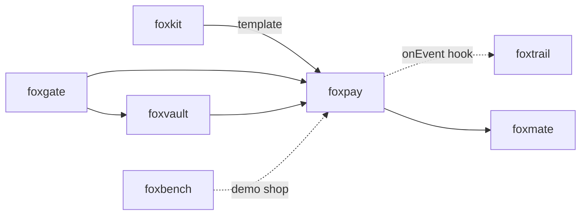

# foxpay

<p align="center">Agent payments with spend caps and approval for each payment.</p>

<p align="center">
  <a href="https://github.com/pooriaarab/foxpay/actions"></a>
  <a href="LICENSE"></a>
</p>

foxpay lets an AI agent ask to pay, and lets a human approve each payment.
The agent writes an intent: the merchant, the amount, the currency, and the
reason. foxpay reads the real amount itself, from the merchant page or from
the `402 Payment Required` answer. Then it asks [foxgate](https://github.com/pooriaarab/foxgate),
which checks the spend cap and waits for a human. After one approval, foxpay
pays one time with a card from [foxvault](https://github.com/pooriaarab/foxvault)
or with an x402 payment on Base Sepolia. Each payment gets a receipt.

No real money moves in this repo. The tests and the demo use test cards, a
fake card provider, the Base Sepolia testnet, and a local fake facilitator.

## Install

```bash
npm i @pooriaarab/foxpay
```

The npm package is `@pooriaarab/foxpay`: npm refuses the plain name `foxpay` as too similar to an existing package (fox-pay).

## Example

This example pays a fake x402 API in Node. It runs as written.

```js
import { createFoxgate, memoryStore } from "foxgate";
import { createVault } from "foxvault";
import { PAY_TOOL, createFoxpay, payTools, x402 } from "@pooriaarab/foxpay";
import { fakeX402Api } from "@pooriaarab/foxpay/testing";

// A Base Sepolia test key and recipient. The fake API stands in for a paid API.
const WALLET_KEY = "0x4c0883a69102937d6231471b5dbb6204fe5129617082792ae468d01a3f362318";
const PAY_TO = "0x209693Bc6afc0C5328bA36FaF03C514EF312287C";

const store = memoryStore();
const { gate, host } = createFoxgate({ tools: payTools(), store });
// A cap of 0.05 test USDC. foxgate counts test USDC as XTS, in atomic units.
await host.addGrant({ scope: "pay", domains: ["api.example"], tools: [PAY_TOOL], spendCap: { value: 50_000, currency: "XTS" } });

const vault = createVault();
await vault.initialize();
await vault.set("vault:wallet", WALLET_KEY, { domains: ["api.example"] });

const api = fakeX402Api({ host: "api.example", payTo: PAY_TO, price: 10_000, body: "sunny" });
const method = x402({ vault, wallet: "vault:wallet", payTo: { "api.example": PAY_TO }, fetch: api.fetch });
const pay = createFoxpay({ gate, store, methods: { x402: method } });

const asked = await pay.request({
  merchant: "api.example",
  amount: 10_000, // 0.01 test USDC
  currency: "USDC",
  reason: "Weather data, one call",
  method: "x402",
  idempotencyKey: "call-0001",
  target: { url: "https://api.example/weather" },
});
console.log(asked.status); // ask

const [request] = await host.pending();
console.log(request.text); // the exact action that the human approves

const done = await pay.complete(asked.id, await host.approve(asked.requestId));
console.log(done.status, done.body); // paid sunny
const again = await pay.request({ merchant: "api.example", amount: 10_000, currency: "USDC", reason: "Weather data, one call", method: "x402", idempotencyKey: "call-0001", target: { url: "https://api.example/weather" } });
console.log(again.status, api.settled.length); // paid 1
```

## Use cases

| Who | What they build | How foxpay helps |
|---|---|---|
| A browser agent author (for example foxmate) | An agent that buys things for the user in a budget | The planner proposes a payment. foxpay reads the total from the checkout page, foxgate refuses anything over the cap, and the user approves the exact amount before the card is filled. |
| A developer of AI tools that call paid APIs | A tool that pays for each API call with x402 | Each `402` answer becomes one intent. foxpay checks the network, the token, and the recipient, then signs one payment with a key that stays in foxvault. |
| A person with SaaS subscriptions | An agent that renews tools within a monthly limit | The host adds a foxgate grant with a `spendCap` and an `expiresAt` at the end of the month, then adds a new grant for the next month. foxpay refuses a renewal that passes the cap. |
| A caregiver or a parent | Purchases that a family member or an assistant starts | The person who holds the budget approves each payment in the popup. A virtual card provider can make a single-use card with the approved limit for the one merchant. |
| A QA engineer | Automated tests of checkout flows on staging | Run real checkouts with test cards and the fake card provider. A retry with the same idempotency key never submits a second order. |
| An MCP server author | A `pay` tool that an outside agent can call | The server calls `request` and returns the waiting request to the client. Only `complete` with a human's token pays. |

## How it works



1. `request` checks the intent. The idempotency key binds it: a retry with
   the same key gets the same request, or the same receipt after payment.
2. The method makes a quote on the host side. Card fill reads the total from
   the top document of the merchant tab. x402 reads the `PAYMENT-REQUIRED`
   header. When the planner amount or currency is different, foxpay refuses.
   It never converts currencies.
3. foxpay builds a foxgate `pay` action from the quote. For x402, the action
   also names the URL and the `402` resource URL in `details`. The `amount` function
   that `payTools()` registers reads the quoted amount, so the planner cannot
   set it. foxgate refuses an amount over the cap before it asks anyone.
4. The human approves the exact action. foxgate signs a one-time token.
5. `complete` runs the method check first: the same page, the same total,
   and an open vault. Then foxgate uses the token and counts the spend.
6. The method pays one time. An intent that was paying when the app stopped
   is never paid again by foxpay. Its outcome is `outcome-unknown`.



Every failure mode has a test: see [docs/failure-modes.md](docs/failure-modes.md).

### The x402 signature

foxpay signs EIP-3009 `TransferWithAuthorization` with EIP-712, for the x402
`exact` scheme on EVM. [`src/eip712.ts`](src/eip712.ts) has about 120 lines
for this one struct. It uses [@noble/curves](https://github.com/paulmillr/noble-curves)
and [@noble/hashes](https://github.com/paulmillr/noble-hashes) (MIT,
audited). The signature domain is `USDC`, version `2`, chain 84532, and the
Base Sepolia USDC contract. The tests compare the digest and the signature
with [viem](https://viem.sh), which is a dev dependency only. The official
`@x402/evm` client (Apache-2.0) depends on viem and zod. foxpay needs one
struct, so it keeps the bundle small and the signing code short enough to read.

## API

This package is a library only. It has no CLI and no MCP server. A payment
needs the approval state in foxgate and the secrets in foxvault, and both live
in one process. A command that starts and stops cannot keep them.

### `createFoxpay(options)`

| Option | What it does |
|---|---|
| `gate` | A foxgate gate made with `createFoxgate({ tools: payTools() })`. Add `[FILL_TOOL]: "fill"` for card fill. |
| `methods` | `{ name: PayMethod }`, for example `{ card: cardFill(...), x402: x402(...) }`. |
| `store` | Where intents and receipts live. Use the same store as foxgate, for example `storageAreaStore(browser.storage.local)`. |
| `onEvent` | `(event) => void \| Promise<void>`. Gets `{ actor: "foxpay", kind, data }`, which fits foxtrail `log.append`. If it throws before a payment, the payment stops with `hook-failed`. |
| `now` | The clock, in ms. Default: `Date.now`. |

| Method | What it does |
|---|---|
| `request(intent)` | Checks and quotes the intent and asks foxgate. Returns `{ status: "ask", id, requestId }`, `{ status: "refused", reason, message }`, or a final result when the intent was already paid or the grant needs no approval. |
| `complete(id, token)` | Pays an approved intent with the foxgate token. Returns `{ status, id, receipt, body? }` or a refusal. Later calls give the same receipt. |
| `intents()` | Every stored intent with its status. |
| `receipts()` | Every receipt, oldest first. |

An intent is `{ merchant, amount, currency, reason, method, idempotencyKey, target? }`.
`amount` is whole minor units: cents for USD, atomic units (6 decimals) for
USDC. `reason` has 1 to 200 characters. `idempotencyKey` has 8 to 128.
`target` is `{ tabId }` for card fill and `{ url }` for x402.

A receipt holds the merchant, the amount, the currency, the reason, the
method, the payee, the status, the request id, the time, and a `proof`. The
proof holds only public data: the last 4 card digits, the card handle or the
provider card id, the page after submit, or the payer, the nonce, the network,
and the transaction hash.

Statuses: `paid` (x402 with a settlement), `submitted` (card checkout
submitted), `unsettled` (no settlement proof; money may have moved), and
`failed` (foxpay knows that nothing was paid).

Refusal reasons: `bad-intent`, `key-reused`, `amount-mismatch`,
`currency-mismatch`, `in-progress`, `outcome-unknown`, `not-found`,
`hook-failed`, `storage-error`, `method-error`, every foxgate deny reason
(for example `spend-cap`, `currency`, `rejected`, `token-used`), and the
method reasons below.

### `cardFill(options)`

| Option | What it does |
|---|---|
| `vault`, `browser` | A foxvault vault (with a gate that has a `fill` grant for the merchant) and the WebExtension `browser` object. foxpay pins every fill, also the foxvault one, to the `documentId` that it checked. Needs a foxvault with the `documentId` fill option. |
| `card` | `{ number, details }`: the handle of the card number and the handle of `"MM/YY CVC"`. |
| `provider` | Or a `VirtualCardProvider` with `createCard({ intentId, merchant, amount })` that returns `{ id, number, exp, cvc }`, and an optional `cancelCard(id)` that foxpay calls when the payment fails before submit. |
| `fields` | `{ number, exp, cvc }`: CSS selectors in the checkout page. |
| `total`, `submit` | The selector of the total text and of the pay button. |
| `currency` | The merchant currency. foxpay never reads it from the page. |
| `decimals` | Default: 2. |
| `allowHttp` | Allow plain `http:` pages. For local tests only. |
| `waitMs` | How long to wait for the page after submit. Default: 10 seconds. |

Reasons: `bad-target`, `no-tab`, `http`, `merchant-mismatch`, `page-changed`,
`amount-changed`, `no-total`, `no-card`, `domain`, `locked`,
`provider-error`, `not-found`, and every foxvault fill reason. When a step
fails after the number fill, foxpay clears the card fields first. When the
submit script starts but its result is lost, the status is `unsettled` with
`submit-unknown`, because the order may be placed.

### `x402(options)`

| Option | What it does |
|---|---|
| `vault`, `wallet` | The vault and the handle of a Base Sepolia test wallet key (0x and 64 hex digits). |
| `payTo` | `{ host: address }`: the recipient that each merchant must name. |
| `fetch` | Default: the global `fetch`. |
| `confirm` | `(settlement) => Promise<boolean>`. Check the transaction yourself, for example on an RPC node. When it says no, the receipt is `unsettled`. |
| `maxTimeoutSeconds` | The longest time a signed authorization stays valid. Default: 300. |

Reasons before the payment: `bad-target`, `merchant-mismatch`,
`no-recipient`, `no-wallet`, `not-402`, `bad-requirements`,
`requirements-mismatch`, `amount-changed`, `locked`, and `sign-error`
(status `failed`). foxpay does not follow redirects.

After foxpay sends the signed payload, the payee holds a valid authorization
until `validBefore`. So x402 never returns `failed` after that point. The
status is `paid` with a settlement, or else `unsettled` with a reason:
`no-response`, `read-error`, `no-settlement`, `not-confirmed`,
`http-<status>`, or the payee's `errorReason`. A payee refusal is not proof
that no money moved. Check an `unsettled` payment on the chain before you
pay again.

### Write your own method

A `PayMethod` has `quote(intent)`, an optional `check(context)`, and
`pay(context)`.

- `quote` reads the amount and the payee on the host side. Throw
  `PayRefusal` to refuse. Nothing has been approved yet.
- `check` runs before foxgate uses the token. Return a reason, for example
  `amount-changed` or `locked`, to stop with no spend.
- `pay` returns `{ status, reason?, proof?, body? }`. Return `failed` only
  when you know that no money moved. When you do not know, return
  `unsettled`.
- From `pay`, throw `PayRefusal` only before any money can move. foxpay
  records it as `failed` with its reason. foxpay records any other error
  from `pay` as `unsettled` with `method-error`, because it can come after
  money moved. The error message is not kept.


| Export | What it does |
|---|---|
| `payTools()`, `PAY_TOOL` | The foxgate tool registry entry `foxpay.pay`, with an amount function that reads the quoted amount. |
| `GATE_CURRENCY` | `{ USDC: "XTS" }`. foxgate takes 3-letter codes, so test USDC counts as XTS, the ISO 4217 code for tests. |
| `PayRefusal` | Throw it from your own `PayMethod` to refuse with a reason. See "Write your own method". |
| `BASE_SEPOLIA` | The network, chain id, USDC contract, and token domain that x402 accepts. |
| `encodeHeader`, `decodeHeader` | Base64 JSON for the x402 headers. |
| `signAuthorization`, `recoverAuthorizer`, `authorizationDigest`, `addressOf`, `checksumAddress` | The EIP-712 and EIP-3009 helpers. |
| `foxpay/testing`: `fakeX402Api(options)` | A fake paid API with a local fake facilitator. It checks the signature and refuses a used nonce. For tests and demos only. |

### Demo extension

`extension/` is a demo for Firefox 153+. The popup shows the spend caps and
what is left, the payments that wait for approval with their exact action
JSON, and the receipts. A simulated agent pays for a
[foxbench](https://github.com/pooriaarab/foxbench) Trailhead Supply checkout
with a test card, or calls a local fake x402 API.

```bash
pnpm install
pnpm e2e        # builds, loads the demo in Firefox, and runs the E2E checks
pnpm build:ext  # builds dist-ext/; load it from about:debugging
```

`pnpm e2e` writes `artifacts/e2e-<date>.json`. It checks a $26.00 order under
a $100 cap with one approval (the foxbench server sees the order and card
ending 4242), a $500 order that is refused before any fill, and an x402 call
that pays one time while a replay is refused.

## Firefox APIs used

| API | MDN | Why |
|---|---|---|
| `webNavigation.getFrame` | [getFrame](https://developer.mozilla.org/en-US/docs/Mozilla/Add-ons/WebExtensions/API/webNavigation/getFrame) | Read the URL and the `documentId` of the top document of the checkout tab. |
| `scripting.executeScript` with `documentIds` (Firefox 153+) | [executeScript](https://developer.mozilla.org/en-US/docs/Mozilla/Add-ons/WebExtensions/API/scripting/executeScript) | Read the total, fill the expiry and the CVC, and submit, in that exact document only. |
| `storage.local` | [storage.local](https://developer.mozilla.org/en-US/docs/Mozilla/Add-ons/WebExtensions/API/storage/local) | Keep intents, receipts, foxgate state, and foxvault ciphertexts. |
| IndexedDB (through foxvault) | [IndexedDB API](https://developer.mozilla.org/en-US/docs/Web/API/IndexedDB_API) | Keep the non-extractable vault key. |
| `fetch` with host permissions | [fetch](https://developer.mozilla.org/en-US/docs/Web/API/Window/fetch) | Call the paid API and read the x402 headers. |
| `crypto.getRandomValues`, `crypto.randomUUID` | [getRandomValues](https://developer.mozilla.org/en-US/docs/Web/API/Crypto/getRandomValues) | Make the x402 nonce and the virtual card handles. |
| `btoa`, `atob`, `TextEncoder`, `TextDecoder` | [btoa](https://developer.mozilla.org/en-US/docs/Web/API/Window/btoa) | Encode the x402 headers as base64 JSON. |
| `publicSuffix.getDomain` (Firefox 153+) | [publicSuffix](https://developer.mozilla.org/en-US/docs/Mozilla/Add-ons/WebExtensions/API/publicSuffix) | foxgate and foxvault refuse `*.` patterns on a public suffix. Demo only. |
| `tabs.query` | [tabs.query](https://developer.mozilla.org/en-US/docs/Mozilla/Add-ons/WebExtensions/API/tabs/query) | Find the checkout tab of the merchant. Demo only. |
| `runtime.sendMessage`, `runtime.onMessage` | [runtime](https://developer.mozilla.org/en-US/docs/Mozilla/Add-ons/WebExtensions/API/runtime) | The popup talks to the background page. Demo only. |
| `action` (`default_popup`) | [action](https://developer.mozilla.org/en-US/docs/Mozilla/Add-ons/WebExtensions/API/action) | The toolbar button that opens the approval popup. Demo only. |

## Limits

- x402 pays on Base Sepolia only. The network and the USDC contract are
  fixed in the code. There is no mainnet option.
- foxpay was tested with its own fake facilitator only. It follows the x402
  version 2 HTTP headers, but no test ran against the public x402.org
  facilitator or a real chain.
- There is no real virtual card provider yet. `VirtualCardProvider` is the
  interface for one, such as Stripe Issuing or Privacy.com. The tests use a
  fake provider.
- Card fill works in the top document only. A card form inside an iframe,
  for example a hosted payment field, cannot be filled.
- A card payment ends as `submitted`. foxpay sees the page after submit, not
  the charge. The total is what the merchant page shows.
- Each merchant needs its own selectors for the card fields, the total, and
  the pay button.
- foxvault values need 8 characters or more, so the expiry and the CVC are
  one secret, `"MM/YY CVC"`. foxpay fills them through `vault.use` with its
  own bundled function, pinned to the same document. `redact` finds that
  pair, not the CVC alone.
- foxgate counts the spend when the token is used. A payment that fails
  after that still counts against the cap. Before the token, foxpay checks
  the page total or fetches the `402` again, so a changed price is refused
  with no spend.
- `outcome-unknown` needs a person. foxpay does not check with the merchant
  or the chain if an interrupted payment went through.
- Run one foxpay object, one foxgate gate, and one vault for each store, in
  the background page. Two objects on the same store can race.
- Legal and compliance: foxpay is not a payment processor, a wallet service,
  or financial advice. A real card number in a browser extension can bring
  your app into the scope of PCI DSS and your card issuer's terms. Paying
  with real stablecoins can bring money transmission and sanctions rules.
  Get legal advice before you use real money.

## Part of the fox primitives



foxpay depends on foxgate for approvals and caps, and on foxvault for the
card and the wallet key. foxtrail and foxbench are dev dependencies only:
the tests write events to a foxtrail log, and the E2E test uses the foxbench
shop.

## License

[MIT](LICENSE)
